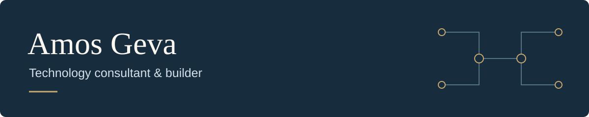

### AI automation · Cloud infrastructure · Business integrations

I bring **25+ years of technology experience** to building AI agents, modernizing Microsoft 365, and connecting business systems. My work spans architecture, hands-on development, and deployment.

**[Website](https://amosgeva.me/)** · **[LinkedIn](https://www.linkedin.com/in/amosgeva/)** · **[Explore my repositories](https://github.com/amosgeva?tab=repositories)**

## Selected work

**[PortfolioDB](https://github.com/amosgeva/PortfolioDB)**  
A self-hosted portfolio ledger built on PostgreSQL, with FIFO and average-cost calculations and an MCP server for AI-agent access.  
Python · PostgreSQL · Docker · MCP

**[Hostinger VPS Manager](https://github.com/amosgeva/HostingerVPSManager)**  
A desktop application for managing Hostinger VPS infrastructure, with multi-account support, monitoring, firewall controls, and SSH-key management.  
Python · PyQt6 · Hostinger API

Other work includes **KYC Vault**, a secure workflow and document platform, and **daybase.work**, a business operations platform.

## Areas of focus

- **AI & integrations:** AI agents, MCP servers, APIs, and accounting and CRM workflows.
- **Microsoft 365:** Exchange Online, identity automation, and modernization.
- **Cloud & operations:** Linux, Docker, VPS infrastructure, monitoring, and secure deployments.

## Work with me

Available for cloud architecture, Microsoft 365 modernization, secure automation, and AI-agent and business-system integrations.

